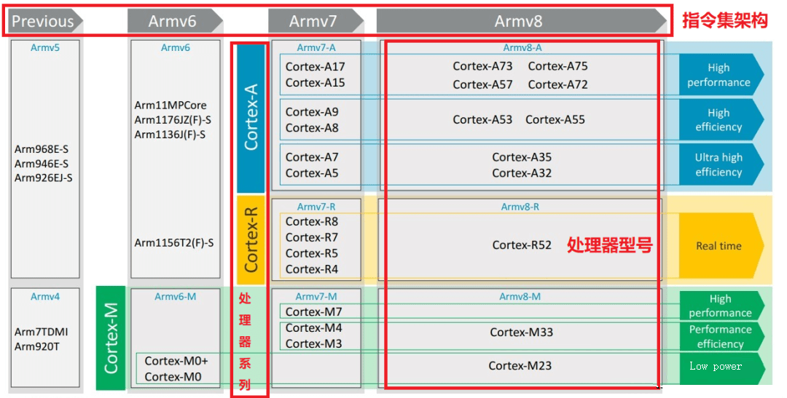
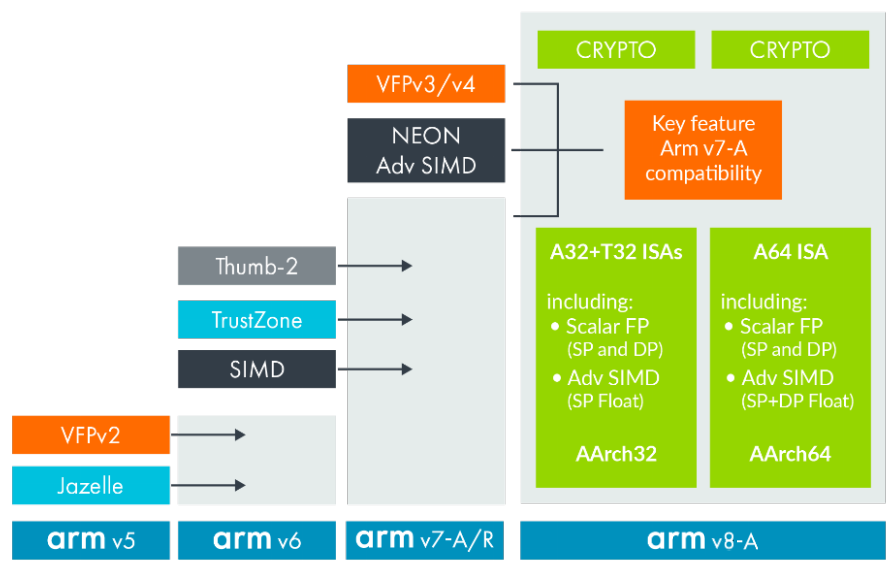
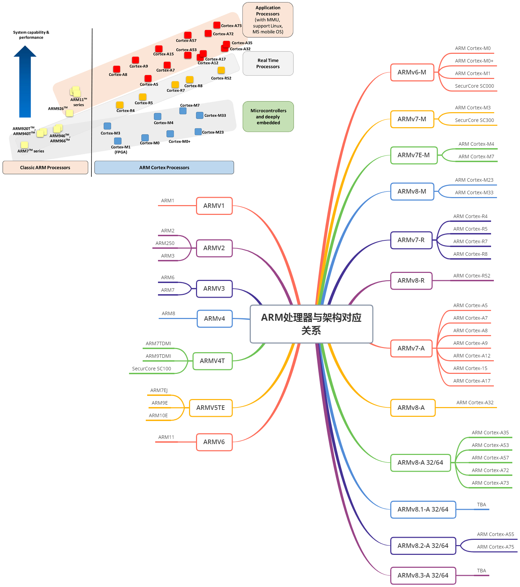
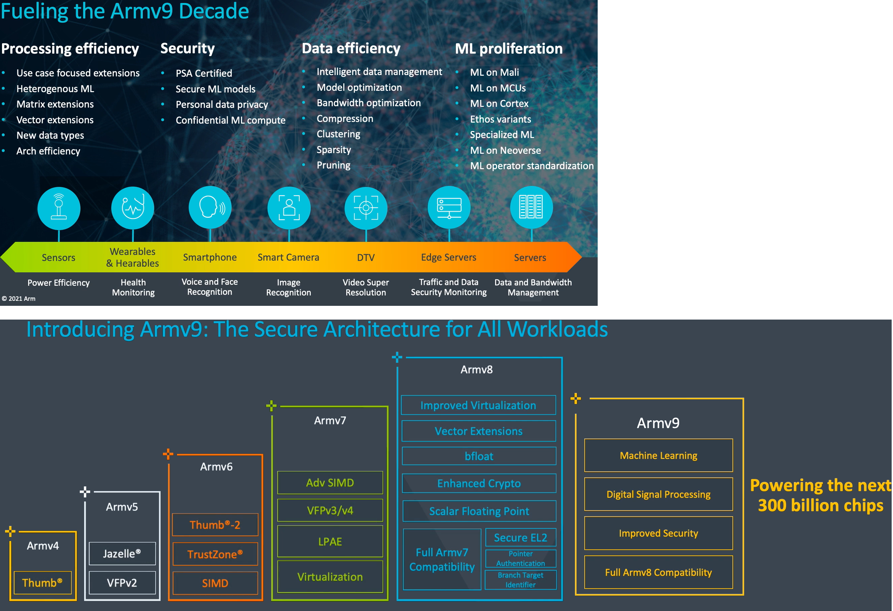
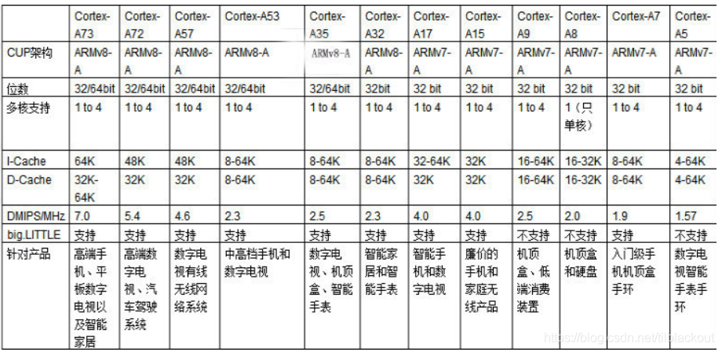
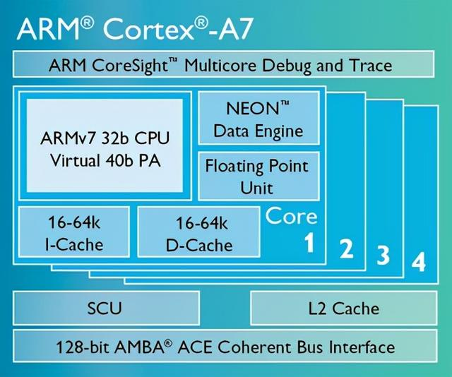
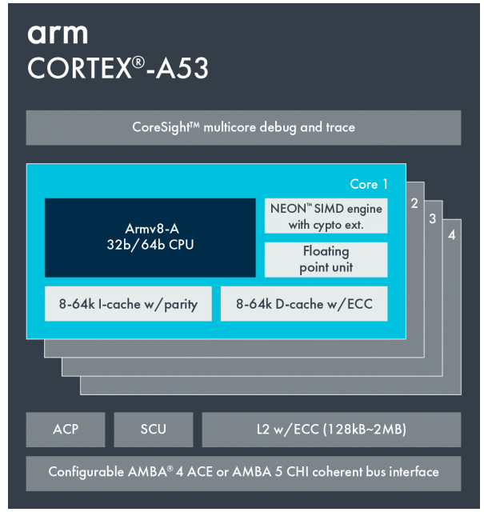
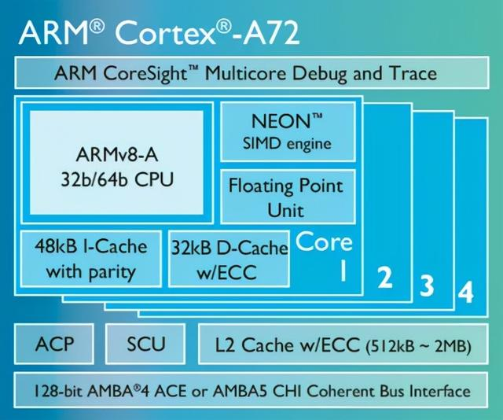

# ARM CPU Architecture

2019 年 5 月，ARM 发布了 Cortex-A77 CPU 和 Mali-G77 GPU 架构（准确说是 IP，又称内核授权）。

2020 年 5 月，ARM 正式发布了下一代 IP，由 Cortex-X1、Cortex-A78 和 Mali-G78 组成的“三剑客”。

## ARM 的 命名

ARM的命名分为指令集架构、处理器架构、处理器型号三类命名规则

### 指令集架构

- ARMv3 、ARMv4 、ARMv5 、ARMv6 、ARMv7、ARMv8、ARMv9

- | 架构  | 处理器家族                                                   | 芯片型号(三星)  |
  | ----- | ------------------------------------------------------------ | --------------- |
  | ARMv3 | ARM6、ARM7                                                   | S3C44B0         |
  | ARMv4 | StrongARM、ARM7TDMI、ARM9TDMI                                | S3C2440/S3C2410 |
  | ARMv5 | ARM7EJ、ARM9E、ARM10E、XScale                                |                 |
  | ARMv6 | ARM11、Cortex-M                                              | S3C6440         |
  | ARMv7 | Cortex-M、Cortex-A、Cortex-R                                 |                 |
  | ARMv8 | Cortex-A32、A35、A53、A57、A72、A73 Cortex-R52 Cortex-M23、M33、M35P、M55 |                 |
  | ARMv9 |                                                              |                 |

- 

### 处理器架构系列

- Cortex-M 系列：
  - 针对微控制器，即 "Microcontroller" -Profile
  - 侧重微控制器单片机方面的场合。主要针对成本和功耗敏感的应用，如智能测量、人机接口设备、汽车和工业控制系统、家用电器、消费性产品和医疗器械等。
  - 超低的功耗、面积  (ARMv6 指令集架构)：M0，M0+，M1（冯诺依曼架构）
  - 平衡  (ARMv7 指令集架构)：M3，M4，M7（哈佛架构）
  - ARMv8 指令集架构：Cortex-M23、M33、M35P、M55：M23是冯诺依曼架构，其它都是哈佛架构。
- Cortex-R 系列：
  - 针对实时系统，即 "Real-Time"-Profile，侧重于实时系统的场合。
  - 针对需要运行实时操作的系统应用，面向如汽车制动系统、动力传动解决方案、大容量存储控制器等深层嵌入式实时应用。
  - ARMv7 指令集架构
    - 功能安全：R4，R5
    - 存储、调制解调：R7，R8
  - ARMv8 指令集架构：R52
- Cortex-A 系列：
  - 面向尖端的基于虚拟内存的操作系统和用户应用，即 “Application”-Profile，侧重于应用功能的场合。
  - 针对日益增长的消费娱乐和无线产品设计，用于具有高计算要求、运行丰富操作系统及提供交互媒体和图形体验的应用领域。
  - 如智能手机、平板电脑、汽车娱乐系统、数字电视，智能本、电子阅读器、家用网络、家用网关和其他各种产品。
  - 节能 (Ultra High Efficiency) 
    - ARMv7 指令集架构: A5(2009)，A7(2011)
    - ARMv8 指令集架构: A32，A35
  - 平衡 (High Efficiency) 
    - ARMv7 指令集架构: A8(2005)，A9(2007)
    - ARMv8 指令集架构: A53
  - 性能 (High Performance) 
    - ARMv7 指令集架构: A15(2010)，A17(2014)
    - ARMv8 指令集架构: A57，A72、A73
- Cortex-SC 系列：
  - 主打安全的 Cortex-SC 系列 (SC：SecurCore)，主要用于政府安全芯片。
  - SC000  (ARMv7 指令集架构)
  - SC300  (ARMv7 指令集架构)

### 处理器型号

- Cortex-M0+，Cortex-M3，Cortex-M4......
- Cortex-R4，Cortex-R5，Cortex-R52，......
- Cortex-A7，Cortex-A9，Cortex-A53，Cortex-A73，......

## ARM 处理器与架构对应关系

# ARMv7 vs ARMv8 

特性比较

| 特性           | ARMv7                              | ARMv8                                              |
| -------------- | ---------------------------------- | -------------------------------------------------- |
| 指令集         | 32 位指令集 A32 和 16 位指令集 T16 | 64 位指令集 AArch64， 并且兼容 32 位指令集 AArch32 |
| 支持地址长度   | 32 位                              | 64 位                                              |
| 通用寄存器     | 15 个, r0-r14 (32位)               | 31个 x0-x30(64位) 或者 w0-w30(32位)                |
| 异常模式       | 2 层结构 vector table              | 4 层结构 EL0-EL3                                   |
| NEON           | 可选支持                           | 默认支持                                           |
| LAPE           | 可选支持                           | 默认支持                                           |
| Virtualization | 可选支持                           | 默认支持                                           |
| big.LITTLE     | 支持                               | 支持                                               |
| TrustZone      | 默认支持                           | 默认支持                                           |
| SIMD寄存器     | 32个 X 64位                        | 32个 X 128位                                       |

# ARMv7

- ARMv7 架构是在 ARMv6 架构的基础上诞生的。
- 该架构采用了 Thumb-2 技术，Thumb-2 技术是在 ARM 的 Thumb 代码压缩技术的基础 上发展起来的，并且保持了对现存 ARM 解决方案的完整的代码兼容性。
- Thumb-2 技术比纯 32 位代码少使用 31％ 的内存，减小了系统开销。同时能够提供比已有的基于 Thumb 技术的解决方案高出 38％的性能。
- ARMv7 架构还采用了 NEON 技术，将 DSP 和媒体处理能力提高了近 4 倍，并支持改良的浮点运算，满足下一代 3D 图形、游戏物理应用以及传统嵌入式控制应用的需求。
- ARMv7 首次增加 M (长乘法指令)，NEON (DSP + SIMD)
- 此外，ARMv7 还支持改良的运行环 境，以迎合不断增加的 JIT (Just In Time) 和 DAC (DynamicAdaptive Compilation) 技术的使用。
- ARMv7 架构的时候开始以 Cortex 来命名，并分成 Cortex-M、Cortex-R、Cortex-A 三种不同类别的处理器系列。

# ARMv8

- ARMv8-A
  - Armv8-A 架构引入了使用 64 位和 32 位执行状态的能力，分别称为 AArch64 和 AArch32。
  - AArch64 执行状态支持 A64 指令集。 它在 64 位寄存器中保存地址，并允许基本指令集中的指令使用 64 位寄存器进行处理。 
  - AArch32 执行状态是一个 32 位执行状态，它保留了与 Armv7-A 架构的向前兼容性，增强了该配置文件，使其可以支持 Arch64 状态中包含的某些功能。 它支持 T32 和 A32 指令集。
  - 节能 (Ultra High Efficiency) 
    - ARMv8 指令集架构: A32，A35
  - 平衡 (High Efficiency) 
    - ARMv8 指令集架构: A53
  - 性能 (High Performance) 
    - ARMv8 指令集架构: A57，A72、A73
- ARMv8-R
  - ARMv8 指令集架构：R52
- ARMv8-M
  - ARMv8 指令集架构：Cortex-M23、M33、M35P、M55：M23是冯诺依曼架构，其它都是哈佛架构。

# ARMv9

ARMv9 架构是今年（2021年）才推出的，将有更多系列处理器。

ARMv9 将提供更高的性能，增强的安全性以及 DSP 和 ML （Machine Learning，机器学习）功能。

Armv9-A 架构建立在 Armv8-A 架构的基础上并向前兼容。

Armv9-A 架构引入了一些主要的新特性：

- SVE2: extending the benefit of scalable vectors to many more use cases
- Realm Management Extension (RME): extending Confidential Compute on Arm platforms to all developers. Read more about Confidential Compute and Arm architecture security features
- BRBE: providing profiling information, such as Auto FDO
- Embedded Trace Extension (ETE) and Trace Buffer Extension (TRBE): enhanced trace capabilities for Armv9
- TME: hardware transactional memory support for the Arm architecture

# ■■■■■■■■■■■■■■■■■

# ARM Studio

# ■■■■■■■■■■■■■■■■■

# Cortex-M 系列

## Cortex-M0+

## Cortex-M3

# ■■■■■■■■■■■■■■■■■

# Cortex-A 系列

## Cortex-A 系列比较

## Cortex-A7

- Cortex-A7 采用 ARMv7-A 架构，它的特点是在保证性能的基础上提供了出色的低功耗表现。

- Cortex-A7 处理器的体系结构和功能集与 Cortex-A15 处理器完全相同，不同这处在于，Cortex-A7 处理器的微体系结构侧重于提供最佳能效，因此这两种处理器可在 big.LITTLE（大小核大小核心伴侣结构）配置中协同工作，从而提供高性能与超低功耗的终极组合。

- 单个 Cortex-A7 处理器的能源效率是 Cortex-A8 处理器的 5 倍，性能提升 50%，而尺寸仅为后者的五分之一。

  

## Cortex-A53

- Cortex-A53 采取了ARMv8-A 架构，能够支持 32 位的 ARMv7 代码和 64 位代码的 AArch64 执行状态。
- Cortex-A53 架构特点是功耗降低、能效提高。其目标是 28nm HPM 制造工艺下、运行 SPECint2000 测试时，单个核心的功耗不超过 0.13 W。
- Cortex-A53 提供的性能比 Cortex-A7 处理器的功率效率更高，并能够作为一个独立的主要的应用处理器，或者搭配 Cortex-A57 处理器构成 big.LITTLE 配置。
- Cortex-A53 在相同的频率下，能提供比 Cortex-A9 更高的效能。其主要面对的是中高端电脑，平板电脑，机顶盒，数字电视等。

## Cortex-A72

- Cortex-A53 和 Cortex-A72 都是 Armv8-A 架构的实现。 这意味着它们具有相同的架构，但它们具有非常不同的微架构。

- Cortex-A72 发布于 2015 年年初，也是基于 ARMv8-A 架构，采用台积电 16nm FinFET 制造工艺。

- Cortex-A72 可在芯片上单独实现性能，也可以搭配 Cortex-A53 处理器与 ARMCoreLinkTMCCI 高速缓存一致性互连（CacheCoherentInterconnect）构成 ARMbig.LITTLETM 配置，进一步提升能效。

- 在相同的移动设备电池寿命限制下，Cortex-A72 能相较基于Cortex-A15 的设备提供 3.5 倍的性能表现，相比于 Cortex-A57 也有约 1.8 倍的性能提升，展现出了优异的整体功耗效率。

- Cortex-A72 其应用市场包括高端智能手机、大屏幕的移动设备、企业网路设备、服务器、无线基台、数字电视。

  

