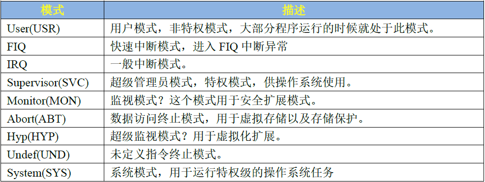
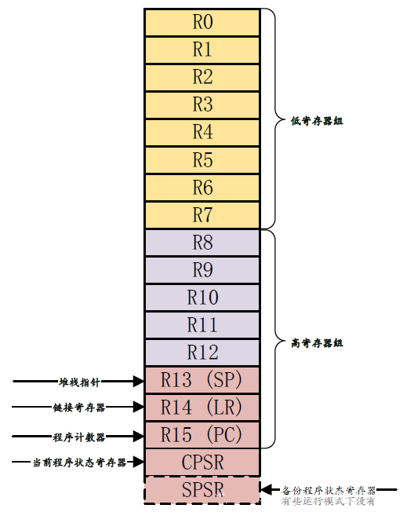
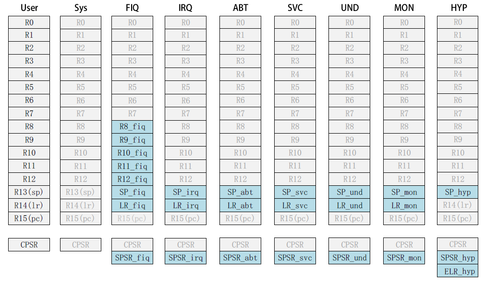

# ARMv7_Cortex-A7

## Cortex-A   9 种运行模式

除了 User(USR) 用户模式以外，其它 8种运行模式都是特权模式。这几个运行模式可以通过软件进行任意切换，也可以通过中断或者异常来进行切换。受限的资源就必须进行模式切换。但是用户模式是不能直接进行切换的，用户模式下需要借助异常来完成模式切换，当要切换模式的时候，应用程序可以产生异常，在异常的处理过程中完成处理器模式切换。

## Cortex-A 寄存器组

Cortex-A 架构提供了16 个 32 位的通用寄存器 (R0~R15) 供软件使用，前 15 个 (R0~R14) 可以用作通用的数据存储， R15 是程序计数器 PC，用来保存将要执行的指令。 ARM 还提供了一个当前程序状态寄存器 CPSR 和一个备份程序状态寄存器 SPSR，SPSR 寄存器就是 CPSR 寄存器的备份。

Cortex-A7 有 9 种运行模式，每一种运行模式都有一组与之对应的寄存器组。每一种模式可见的寄存器包括 15 个通用寄存器 (R0~R14)、一两个程序状态寄存器和一个程序计数器 PC。在这些寄存器中，有些是所有模式所共用的同一个物理寄存器，有一些是各模式自己所独立拥有的。浅色字体的是与 User 模式所共有的寄存器，蓝绿色背景的是各个模式所独有的寄存器。

R0-R7：未备份寄存器，所有的处理器模式下这 8 个寄存器都是同一个物理寄存器，在不同的模式下，这8个寄存器中的数据就会被破坏。所以没有特殊用途

R8-R12：备份寄存器，在快速中断模式下 (FIQ) 它们对应着 Rx_irq(x=8~12) 物理寄存器，其他模式下对应着 Rx(8~12) 物理寄存器。

R13：栈指针，一共有 8 个物理寄存器，其中一个是用户模式 (User) 和系统模式 (Sys) 共用的，剩下的 7个分别对应 7 种不同的模式。

R14：连接寄存器，当呼叫一个子程序时，由 R14 存储返回地址。一共有 7个物理寄存器，其中一个是用户模式 (User)、系统模式 (Sys)和超级监视模式 (Hyp) 所共有的，剩下的 6 个分别对应 6种不同的模式。

R15：程序计数寄存器，指向当前的程序地址。如果修改它的值，就能改变程序的执行流

CPSR：当前程序状态寄存器。该寄存器包含了条件标志位、中断禁止位、当前处理器模式标志等一些状态位以及一些控制位

总结一下， Cortex-A 内核寄存器组成如下：

①、 34 个通用寄存器，包括 R15 程序计数器 (PC)，这些寄存器都是 32 位的。

②、 8 个状态寄存器，包括 CPSR 和 SPSR。

③、 Hyp 模式下独有一个 ELR_Hyp寄存器。
