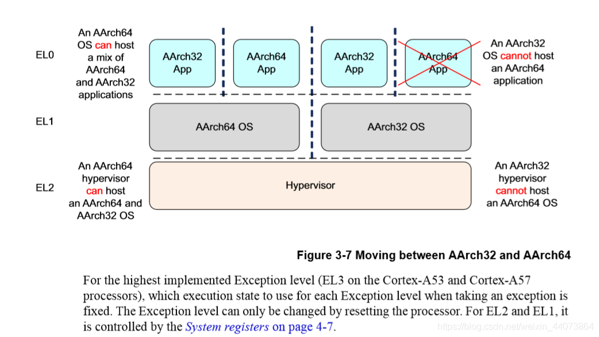
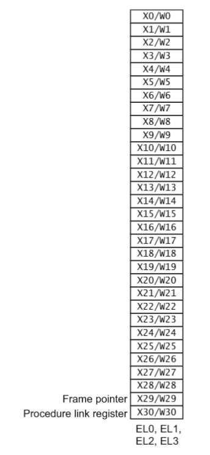
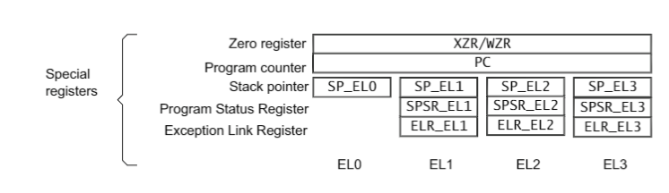
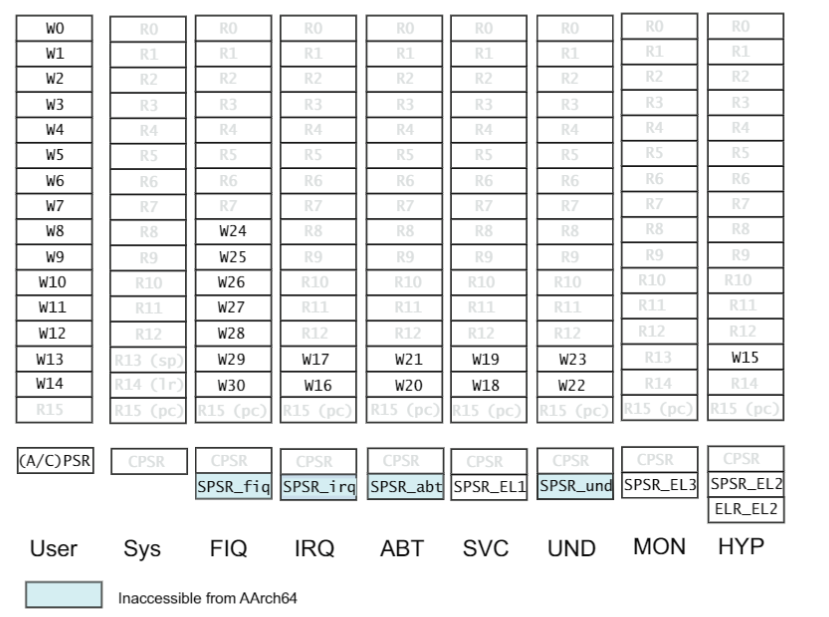
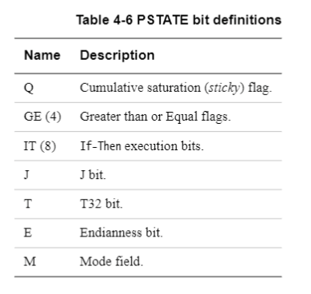
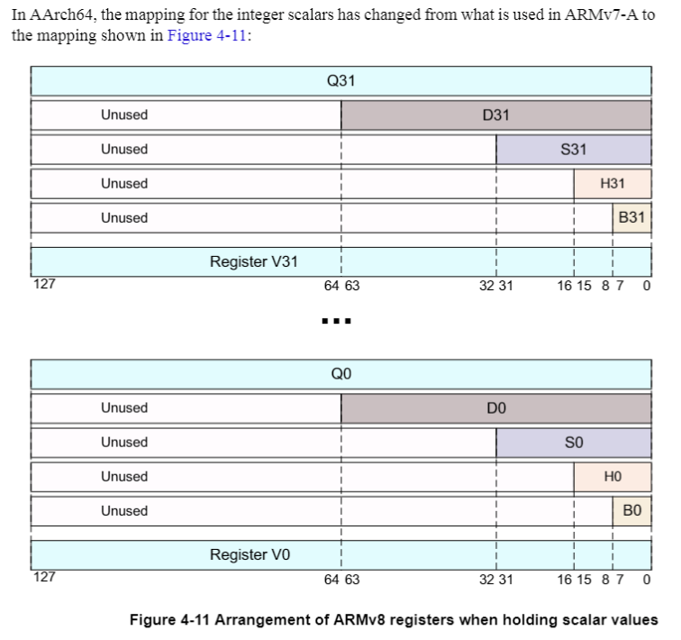
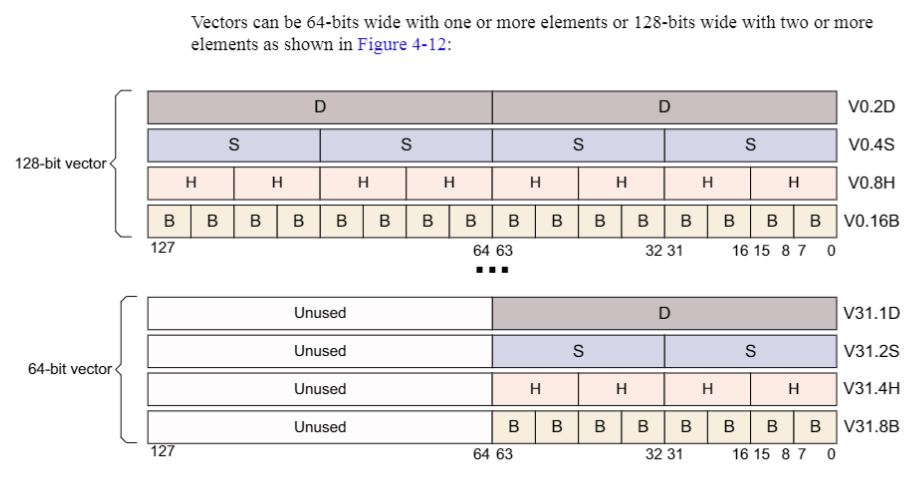
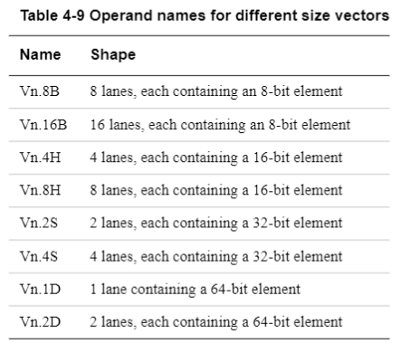
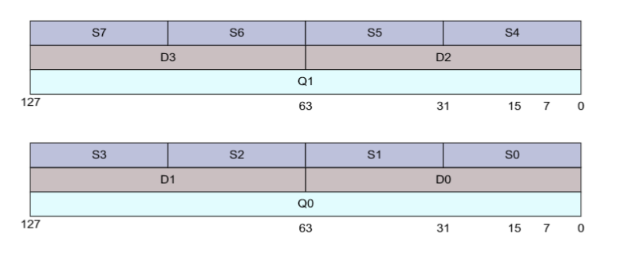

# ARMv8_Cortex-A53

## ARMv8 

随着开发工作逐渐迁移到 ARMv8 的 64 位平台，因此有必要尽快熟悉 ARMv8 架构。ARMv8 与先前较为熟悉的 ARMv7 架构有较大变化，其中非常重要的一点是支持了 A64 指令集，大大提升了处理器的性能。从目前的的了解来看，基本上 ARMv8 与上代架构的差别非常大的。除了 A64 指令集之外，还有许多地方都有较大改动，下面列出几个目前比较关注的点：

- 执行状态与异常级别（异常级别为 EL0 - EL3）
- ARMv8 寄存器组（和先前完全不同的 64 位寄存器）
- A64 指令集（新的 64 位指令集）
- 内存管理（毕竟地址空间变成 64 位了）
- Memory Ordering
- 安全系统（例如普通世界和安全世界的切换）

## ARMv8 处理器架构系列

- ARMv8-A
  - Armv8-A 架构引入了使用 64 位和 32 位执行状态的能力，分别称为 AArch64 和 AArch32。
  - AArch64 执行状态支持 A64 指令集。 它在 64 位寄存器中保存地址，并允许基本指令集中的指令使用 64 位寄存器进行处理。 
  - AArch32 执行状态是一个 32 位执行状态，它保留了与 Armv7-A 架构的向前兼容性，增强了该配置文件，使其可以支持 Arch64 状态中包含的某些功能。 它支持 T32 和 A32 指令集。
  - 节能 (Ultra High Efficiency) 
    - ARMv8 指令集架构: A32，A35
  - 平衡 (High Efficiency) 
    - ARMv8 指令集架构: A53
  - 性能 (High Performance) 
    - ARMv8 指令集架构: A57，A72、A73
- ARMv8-R
  - ARMv8 指令集架构：R52
- ARMv8-M
  - ARMv8 指令集架构：Cortex-M23、M33、M35P、M55：M23是冯诺依曼架构，其它都是哈佛架构。

# ARMv8-A 架构基础

- ARMv8 架构兼容了 ARMv7 架构的关键特性，例如支持 A32 和 T32 指令集，单精度浮点操作以及基于单精度浮点的 SIMD 指令。 
- ARMv7 为什么不支持双精度浮点的 SIMD 指令呢？也许是可用的浮点寄存器不够吧，AArch64 使用了 `32*128-bit` 的浮点寄存器，比 ARMv7 要多了一倍。

	

## 执行状态与异常级别 

- 在 ARMv8 架构中定义了两种执行状态，AArch64 以及 AArch32。
- 这两种执行状态分别用于描述执行使用 64 位宽的通用寄存器或者使用 32 位宽的通用寄存器。
- 然而在 ARMv8 AArch32 中保留了 ARMv7 中定义的特权级，而在 AArch64 中，特权级通过异常等级被定义。因此执行在异常等级 `ELn` 对应于执行在特权等级 `PLn`。

- 在 AArch64 中，处理器模式在不同的异常等级间切换，就像指在 ARMv7（AArch32） 中当异常被处理时，处理器切换到相应的异常等级来处理异常。
- 可以看出先前在 ARMv7 时有各种异常模式，而在 ARMv8 中，这些模式统统都属于 EL1 级别，处理的时候先进入 EL1 的处理函数，然后再通过寄存器信息判断现在发生了哪种异常，然后执行对应的处理函数。
- 下图展示了两种架构在异常处理时的映射关系：

### 改变执行状态

- 如果你运行一个 64 位的 OS，在 EL0 想跑一个 32 位的应用程序时，系统必须改变为 AArch32 状态，当应用程序执行完成或者执行返回到 OS，需要变回 AArch64。
- 一个 AArch32 的 OS 不能跑一个 AArch64 的应用程序。改变执行状态只能通过改变执行权级实现。
- 在 EL3 的 code 不能进入到更高的特权级中，所以 EL3 中不能改变执行状态，除非重启。
- 回到 AArch32 执行状态是通过更高的 ELn 到低的 ELn，这是通过 ERET 指令退出异常处理的结果。
- 回到 AArch64 执行状态是通过更低的 ELn 到高的 ELn。
- ARMv8 在 AArch32 下的异常处理类似于 armV7 的异常处理，AArch64 下的异常处理有 AArch64 Exception Handling。
- 一个 AArch64 的 hypervisor 可以 host AArch32 和 AArch64 的 guest OS， 一个 AArch64 的 OS 可以 host AArch32 和 AArch64 的应用程序，反之则不行。

## 执行级别

- 在 ARMv8 架构中，有4个执行级别。在 AArch64 中，这四个级别决定了执行的特权，armv7 中也有类似的特权级别。
- ELn，n 越大特权越高。软件执行在不同的级别，从而实现了不同域的保护。
  - EL0 应用程序
  - EL1 操作系统
  - EL2 hypervisor虚拟机
  - EL3 底层固件，包括secure monitor

- ARMv8-A 有两个安全状态， Secure 和 Non-secure。如图，Non-secure 指n ormal world。
- 这样能使一个 OS 和一个受信任的 OS 一起运行在同一个硬件上，并且提供确定的软件/硬件攻击保护。
- ARM TrustZone 技术将整个系统分为Normal 和 Secure worlds。 

### ELn 之间的转换规则

1. 当转为更高权级表明软件执行特权变高，如 EL0----> EL1
2. 一个异常不可能导致更低的权级
3. 在 EL0 中没有异常处理函数，异常处理函数必须在更高级别中去处理
4. 异常会改变程序执行流程，执行异常处理从高于 EL0 的异常向量表开始。异常：
   中断，如 IRQ FIQ 系统调用。。。。。。。。。
5. 异常处理结尾返回上一个特权级别的指令：ERET
6. 从一个异常返回时可以保持同一个特权级或者进入一个更低的级。不能进入更高的级别。
   

### Normal world（Non-secure）有特权的组件

- Guest OS kernel
  - 当在hypervisor下运行时，**这些OS可以作为guest 还是 host取决于hypervisor model.**
- hypervisor
  - ARMv8-A 提供虚拟技术 hypervisor，其仅在 Normal world（Non-secure）。
  - 当hypervisor 其被 enable 后，为其他 OS 提供虚拟服务
  - hypervisor， 即虚拟机管理 (VMM) 代码可以在系统中运行并且可以主持多个 guest OS。
  - 每个 guest OS 运行在一个虚拟机上，并无意识地和其他 guest OS 共享时间。

### Secure world 有特权的组件

- Secure firmware: 
  - firmware 是第一个被执行的 boot 程序。它提供几个服务，包括平台初始化， trusted OS 的安装， secure monitor 的路由
- trusted OS 
  - trusted OS 为 normal world 提供安全服务， 为安全或者信任的应用程序提供运行环境。
  - AArch64 指令集中，Trusted OS 在 secure EL1, 但是在 AArch32 中，它在 EL3 执行。

### Secure monitor

- ARMv8 的 Secure monitor 不属于Normal world 和 Secure world，它单独处于一个更高级别 EL3
- 和 ARMv7 一样， Secure monitor 扮演一个 Norma l和 Secure worlds 之间的网关角色。
- 

# ARMv8 寄存器组

- AArch64 和 AArch32， 决定使用 64 位宽的通用寄存器还是 32 位宽的通用寄存器。
- AArch32 
  - AArch32 使用 A32 指令集合 T32 (Thumb)指令集

- AArch64
  -  AArch64 执行状态在所有的异常级别下提供了 31 个 64 位通用寄存器，每一个寄存器有 64 位宽，从 X0-X30。
  - AArch64 使用 A64指令集

## AArch64 的通用寄存器组

## AArch64 的特殊寄存器

- 可以看出 AArch64 与先前的寄存器组有了非常大的变化，不仅通用寄存器组的宽度和个数变多了，特殊寄存器组也非常不同。
- 特殊寄存器组最大的变化是，先前在 ARMv7 下各种不同模式下的 BANK 寄存器组都没有了，取而代之的是不同级别异常下的 SP 指针、SPSR 以及异常返回寄存器组。

- 同时为了兼容先前 ARMv7 下 AArch32 执行状态，支持从 AArch64 到 AArch32 寄存器组的映射，如下图所示：

  

- PSTATE at AArch32。在 AArch64 中，传统的 CPSR 寄存器被 PSTATE 取代。

  

## NEON 与浮点寄存器

- 除了通用寄存器组之外， ARMv8 也提供了 32 个 128 位的浮点寄存器组，V0-V31。
- 这 32 个寄存器用户保存浮点操作数用于标量浮点执行或者标量和向量操作数用于 NEON 操作。

### 标量寄存器大小

### 向量寄存器大小

针对不同大小的向量操作：

### NEON 在 AArch32 运行模式下

- 在 AArch32 中，小的寄存器被打包成更大的寄存器，例如 D0 和 D1 被组合成 Q1。
- 这就引入了一些复杂的循环依赖关系，会降低编译器向量化循环结构的能力。

# 
