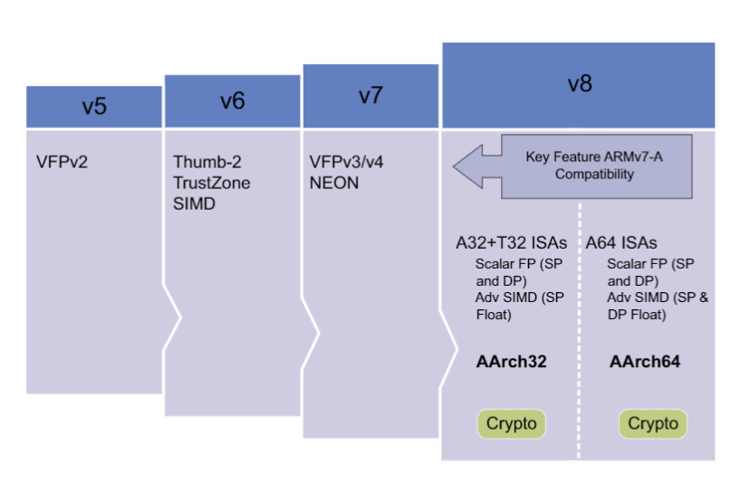
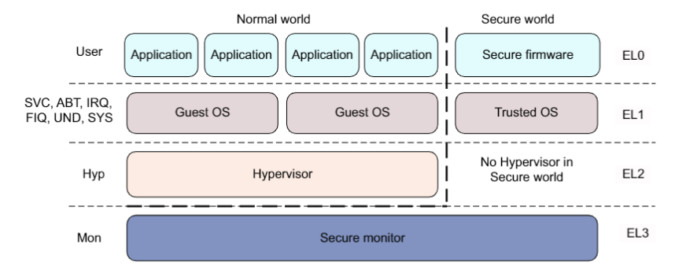

# ARMv8_Cortex-A53

## ARMv8 

随着开发工作逐渐迁移到 ARMv8 的 64 位平台，因此有必要尽快熟悉 ARMv8 架构。ARMv8 与先前较为熟悉的 ARMv7 架构有较大变化，其中非常重要的一点是支持了 A64 指令集，大大提升了处理器的性能。从目前的的了解来看，基本上 ARMv8 与上代架构的差别非常大的。除了 A64 指令集之外，还有许多地方都有较大改动，下面列出几个目前比较关注的点：

- 执行状态与异常级别（异常级别为 EL0 - EL3）
- ARMv8 寄存器组（和先前完全不同的 64 位寄存器）
- A64 指令集（新的 64 位指令集）
- 内存管理（毕竟地址空间变成 64 位了）
- Memory Ordering
- 安全系统（例如普通世界和安全世界的切换）

## ARMv8 处理器架构系列

- ARMv8-A
  - Armv8-A 架构引入了使用 64 位和 32 位执行状态的能力，分别称为 AArch64 和 AArch32。
  - AArch64 执行状态支持 A64 指令集。 它在 64 位寄存器中保存地址，并允许基本指令集中的指令使用 64 位寄存器进行处理。 
  - AArch32 执行状态是一个 32 位执行状态，它保留了与 Armv7-A 架构的向前兼容性，增强了该配置文件，使其可以支持 Arch64 状态中包含的某些功能。 它支持 T32 和 A32 指令集。
  - 节能 (Ultra High Efficiency) 
    - ARMv8 指令集架构: A32，A35
  - 平衡 (High Efficiency) 
    - ARMv8 指令集架构: A53
  - 性能 (High Performance) 
    - ARMv8 指令集架构: A57，A72、A73
- ARMv8-R
  - ARMv8 指令集架构：R52
- ARMv8-M
  - ARMv8 指令集架构：Cortex-M23、M33、M35P、M55：M23是冯诺依曼架构，其它都是哈佛架构。

# ARMv8-A 架构基础

- ARMv8 架构兼容了 ARMv7 架构的关键特性，例如支持 A32 和 T32 指令集，单精度浮点操作以及基于单精度浮点的 SIMD 指令。 
- ARMv7 为什么不支持双精度浮点的 SIMD 指令呢？也许是可用的浮点寄存器不够吧，AArch64 使用了 `32*128-bit` 的浮点寄存器，比 ARMv7 要多了一倍。

	

## 执行状态与异常级别 （异常级别为 EL0 - EL3）

- 在 ARMv8 架构中定义了两种执行状态，AArch64 以及 AArch32。
- 这两种执行状态分别用于描述执行使用 64 位宽的通用寄存器或者使用 32 位宽的通用寄存器。
- 然而在 ARMv8 AArch32 中保留了 ARMv7 中定义的特权级，而在 AArch64 中，特权级通过异常等级被定义。因此执行在异常等级 `ELn` 对应于执行在特权等级 `PLn`。

- 在 AArch64 中，处理器模式在不同的异常等级间切换，就像指在 ARMv7（AArch32） 中当异常被处理时，处理器切换到相应的异常等级来处理异常。
- 可以看出先前在 ARMv7 时有各种异常模式，而在 ARMv8 中，这些模式统统都属于 EL1 级别，处理的时候先进入 EL1 的处理函数，然后再通过寄存器信息判断现在发生了哪种异常，然后执行对应的处理函数。
- 下图展示了两种架构在异常处理时的映射关系：

# 
